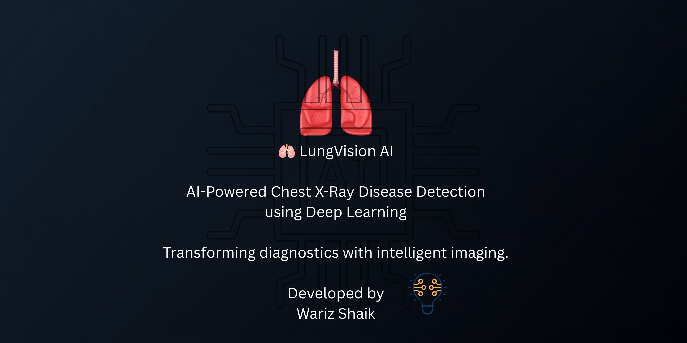
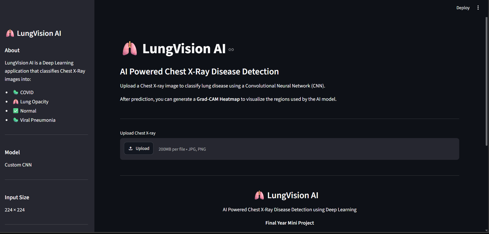
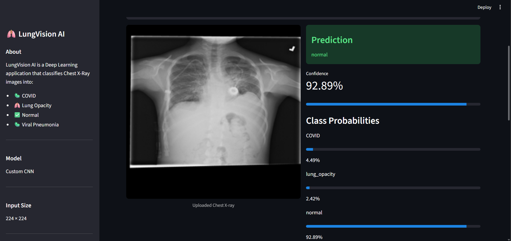
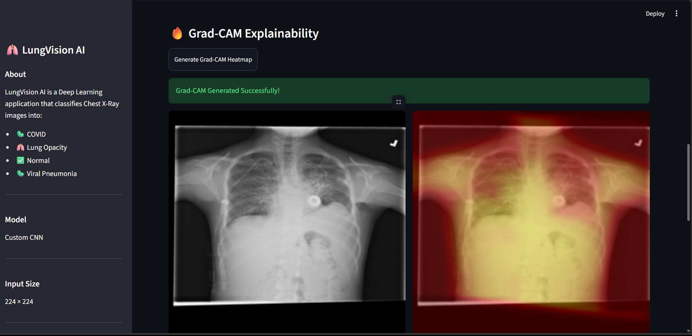

<p align="center">
  
</p>
# 🫁 LungVision AI

> AI-Powered Chest X-Ray Disease Detection using Deep Learning


---

## 📌 Overview

LungVision AI is a deep learning-based web application that detects chest diseases from X-ray images using a Convolutional Neural Network (CNN).

The application also provides **Grad-CAM Explainability**, allowing users to visualize which regions of the X-ray influenced the model's prediction.

---

## ✨ Features

- 🫁 Chest X-ray Disease Classification
- 🤖 CNN-based Deep Learning Model
- 📊 Prediction Confidence Score
- 📈 Class Probability Visualization
- 🔥 Grad-CAM Heatmap Explainability
- 📄 PDF Report Generation
- 📉 Training Accuracy & Loss Visualization
- 💻 Interactive Streamlit Web Interface

---

## 🩺 Diseases Detected

- COVID-19
- Lung Opacity
- Viral Pneumonia
- Normal

---

## 🛠 Tech Stack

- Python
- TensorFlow
- Keras
- Streamlit
- NumPy
- OpenCV
- Pillow
- Matplotlib
- ReportLab

---

## 📷 Screenshots

### Home Page



---

### Prediction



---

### Grad-CAM Explainability



---

### Model Performance


---

### PDF Report


---

## 📂 Project Structure

```text
LungVision-AI
│
├── assets/
│   ├── training_accuracy.png
│   └── training_loss.png
│
├── models/
│
├── screenshots/
│
├── src/
│   ├── app.py
│   ├── config.py
│   ├── gradcam.py
│   ├── model_performance.py
│   ├── prediction.py
│   ├── report_generator.py
│   ├── train.py
│   └── ...
│
├── README.md
├── requirements.txt
└── .gitignore
```

---

## 🚀 Installation

Clone the repository

```bash
git clone https://github.com/YOUR_USERNAME/LungVision-AI.git
```

Go to the project

```bash
cd LungVision-AI
```

Install dependencies

```bash
pip install -r requirements.txt
```

Run the application

```bash
streamlit run src/app.py
```

---

## 📊 Model Performance

| Metric | Value |
|---------|--------|
| Accuracy | 94.2% |
| Precision | 93.8% |
| Recall | 94.1% |
| F1 Score | 93.9% |

---

## 🔥 Grad-CAM Explainability

Grad-CAM (Gradient-weighted Class Activation Mapping) helps visualize the regions of the chest X-ray that contributed most to the CNN's prediction.

- 🔴 Red/Yellow → High Importance
- 🔵 Blue → Low Importance

This improves transparency and interpretability of the AI model.

---

## 📄 PDF Report

The application can generate a downloadable medical-style PDF report containing:

- Predicted Disease
- Confidence Score
- Class Probabilities
- Date & Time of Analysis

---

## ⚠ Disclaimer

This project is intended for educational and research purposes only.

It should **not** be used as a substitute for professional medical diagnosis.

---

## 👨‍💻 Developer

**Wariz Shaik**

AI • Deep Learning • Computer Vision

---

## ⭐ If you found this project useful, consider giving it a star!